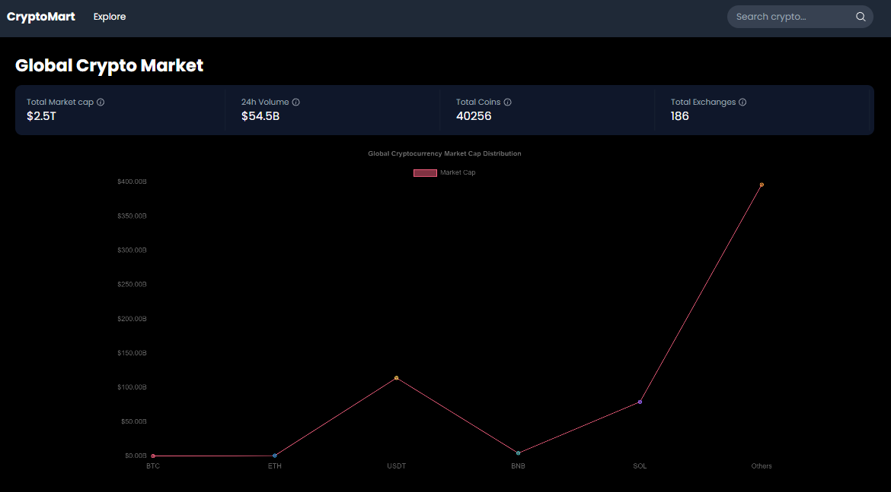
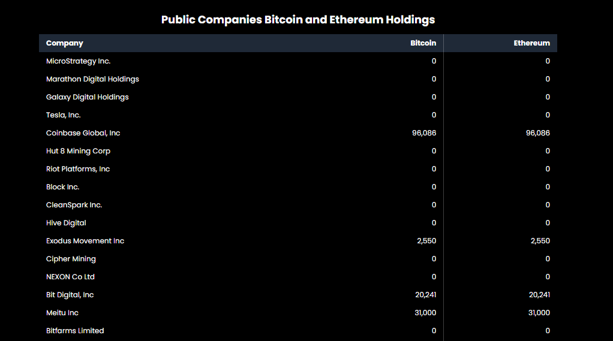
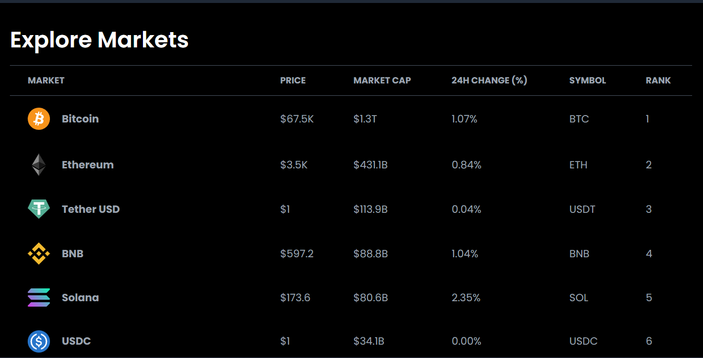
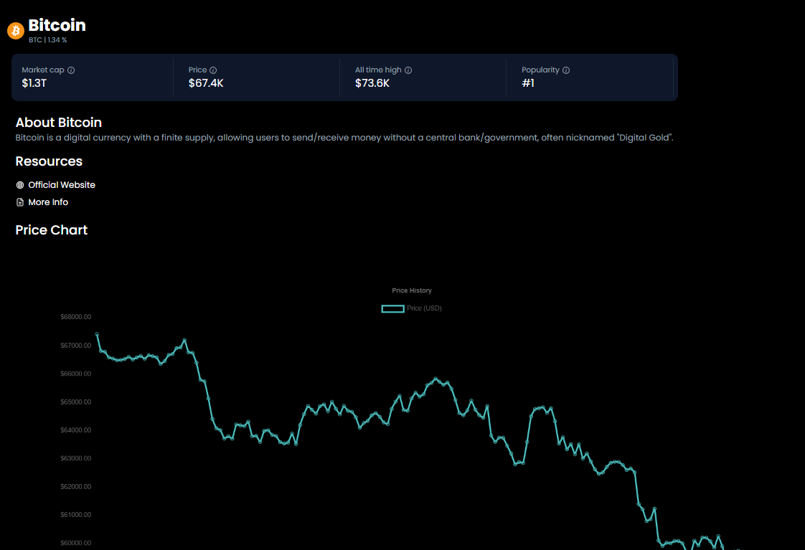
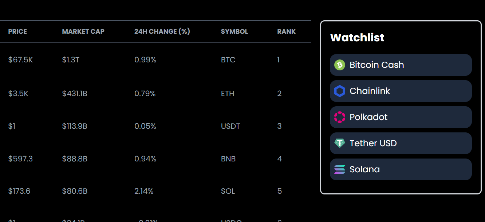
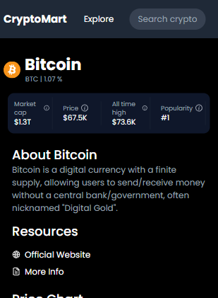

# CryptoMart

This project is an assignment by Ayush Gupta for the role of Frontend Intern at Groww.

## Project Overview

CryptoMart is a comprehensive web application designed to track and analyze various cryptocurrencies. This project was developed as an assignment for the role of Frontend Developer Intern at Groww. It provides real-time updates on cryptocurrency prices, detailed information on individual cryptocurrencies, and features such as an interactive watchlist.

## Tech Stack

- **Frontend Framework**: Next.js 14 (with App Router)
- **Styling**: Tailwind CSS
- **API Integration**: Coinranking API, CoinGecko API
- **Charts**: Chart.js with react-chartjs-2
- **Drag and Drop**: react-dnd
- **Data Formatting**: millify

## Features

1. **Homepage**:
   - Global Market Cap Chart: Displays line graph showing the global market cap data for cryptocurrencies.
   - 
   - Public Companies Holdings: Shows information about public companies holding Bitcoin and Ethereum.
   - 

2. **Explore Page**:
   - Paginated Coin List: Displays a paginated grid of cryptocurrencies (20 items per page).
   - 
   - Coin Details: Clicking on a coin card routes the user to the detailed product page of the selected cryptocurrency.
   

3. **Product Page**:
   - Displays basic information about the selected cryptocurrency.
   - Shows a line graph of the cryptocurrency's price over time.
  - 

4. **Draggable Watchlist**:
   - Implements drag-and-drop functionality allowing users to easily add coins to their watchlist.
   - 

5. **Responsive Design**:
   - The application is fully responsive and works well on both desktop and mobile devices.
   - 

## How to Run the Project
1. Enter the Repository:

```bash
cd Cryptomart-Nextjs
```

2. Install dependencies:
```bash
npm install
```

3. Start the server:
```bash
npm run dev
```

4. Open [http://localhost:3000](http://localhost:3000) in your browser to see the result.

*Note:* *Please do not forget to retrieve valid API Keys from both Coinranking and CoinGecko API.*

## Additional Notes

- This project uses `next/font` to automatically optimize and load Poppins, a custom Google Font.
- The application implements caching strategies to optimize API usage and improve performance.
- Error handling and loading states are implemented for a smooth user experience.


